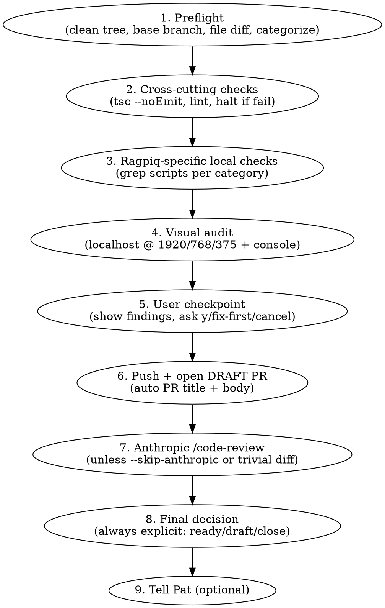

# Ragpiq Pre-PR Audit

## Overview

Before any Ragpiq PR opens, run a 9-phase audit that combines a hard floor (TypeScript + lint always), Ragpiq-specific bug checks (Bubble field_name, n8n env routing, brand voice on marketing files), per-category-aware visual + code review, and Anthropic's `/code-review:code-review` on a draft PR before convert-to-ready.

**Core principle:** Pat's time is more expensive than ~1 minute of automation. The audit always runs the floor checks even under "I'm in a hurry" pressure.

## When to Use

Triggered automatically when the user asks to ship a PR (see description). Also explicit via `/audit-pr` with optional flags:

- `/audit-pr` — default
- `/audit-pr --skip-visual` — skip Phase 4 (backend-only PRs)
- `/audit-pr --skip-anthropic` — skip Phase 7 (cheaper)
- `/audit-pr --draft-only` — never auto-convert to ready
- `/audit-pr --no-push` — local checks only, dry run
- `/audit-pr --deep` — invoke `vercel-agent-skills:web-design-guidelines` if installed

**Don't use for:** non-Ragpiq repos, fixing comments on an already-merged PR.

## The 9-Phase Audit



**Full workflow detail:** see `workflow.md`.

## Quick Reference — Floor (always runs, even under pressure)

| Check | Command / approach | Halts on fail? |
|-------|---------------------|----------------|
| Working tree clean | `git status --porcelain` | Yes — user fixes first |
| On feature branch | `git branch --show-current` ≠ `main` | Yes |
| TypeScript compile | `npx tsc --noEmit` | Yes |
| Lint (if script exists) | `npm run lint` | Yes |
| File categorization | `git diff origin/main --name-only` → grep | No — informational |

## Quick Reference — Ragpiq-specific checks

Run only when the relevant category changed.

| Trigger | Check | Reference |
|---------|-------|-----------|
| `app/api/**/route.ts` or `lib/api/**` with `bubbleGet/Post/Patch` | Validate every constraint key + sortField against `reference/bubble.schema.json` (must be `field_name`, not `field_key`); validate option-set values (case-sensitive) | `checks/bubble-field-names.md` |
| n8n workflow JSON edits OR `ragpiq.bubbleapps.io` outside CDN URLs | Flag any hardcoded LIVE Bubble URL without env switch | `checks/n8n-env-routing.md` |
| `content/**/*.mdx`, `app/(marketing)/**`, `app/resellers/**` | Run brand voice review against `../ragpiq-ops/marketing/brand/voice/_core.md` | `checks/brand-voice.md` |
| Any Bubble route AND `reference/bubble.schema.json` > 30 days old | Schema staleness reminder | `checks/bubble-field-names.md` |
| Root `CLAUDE.md` changed | CLAUDE.md drift reminder | inline |

## Pressure resistance

This skill is **discipline-enforcing** — agents must NOT skip the floor checks under any user pressure. The floor is non-negotiable:

```
"I'm in a hurry" → still run TS + lint (30 sec)
"I tested it manually" → manual testing is a separate check; the floor catches different things
"It's a small fix" → TS + lint take 30 sec regardless of diff size
"Skip the audit" → respected for Phases 4-7; floor still runs
```

If the user explicitly says "I will accept the risk of skipping TS / lint" — only then bypass, and warn.

### Combined pressure does NOT cancel out

A common rationalization: "It's small AND I tested it AND I'm in a hurry AND CI will catch it." Stacking pressure vectors doesn't cancel any of their individual failure modes — it means you'd rather not think about any of them right now. Each pressure has a known failure mode:

- **"Small change"** — small changes still have type errors and lint issues; size doesn't predict either
- **"Tested manually"** — the browser session doesn't show silent type errors in unwalked code paths
- **"In a hurry"** — TS+lint take 30 sec; the floor doesn't add meaningful delay
- **"CI will catch it"** — Vercel build is slower, noisier, blocks the deploy, and burns Pat's review time

When the user stacks all four: the answer is the same as for any single one. **Floor runs.** The skill respects pressure for Phases 4–7 (visual, Anthropic review) — those can be skipped under time pressure. But the 30-second floor never moves.

## Anthropic /code-review skip rules

**Skip Phase 7 only if ALL of these:**
- Diff is < 20 lines
- No new files
- Touches no `lib/auth.ts`, no middleware, no API routes touching Bubble, no auth/session/token paths
- Pre-checks (Phases 1–4) all passed cleanly

Otherwise Phase 7 runs (cost ~$0.30, time ~60–90 sec). **Per-category nuance:**

- New API route → Phase 7 mandatory (CLAUDE.md compliance check via Agent #1)
- New component → Phase 7 mandatory (catches missing aria-labels, focus-visible, blob URL leaks like AI Lister PR)
- Docs-only change → Phase 7 optional
- Pure refactor / type-only change → Phase 7 optional

## Common Mistakes

| Mistake | Fix |
|---------|-----|
| Running `gh pr create` without TS check | TS is the floor. Always. |
| Running ALL checks for every PR | Categorize first. Skip irrelevant checks. |
| Auto-converting draft → ready without user OK | Always explicit per Patrick's memory rule |
| Hardcoding `ragpiq.bubbleapps.io` in n8n nodes | Use env switch — see `checks/n8n-env-routing.md` |
| Using Bubble `field_key` instead of `field_name` | Grep the schema before sending — see `checks/bubble-field-names.md` |
| Drafting PR description by hand | Use `scripts/pr-template.py` |

## Real-world impact

This skill was designed from the failures of PR #42 (AI Lister processing queue) where:

- Bubble `field_key` bug took ~1 hour to diagnose (would have been caught by Check 1 in <5 sec)
- n8n LIVE Bubble URL hardcoded in 4 sub-workflows took ~30 min to diagnose (would have been caught by Check 2)
- Multiple aria-label / focus-visible / blob-URL-leak issues caught by post-hoc code review (would have been caught by Phase 7 Anthropic review)
- ~3 hours of cumulative debug time → all preventable

Target: every Ragpiq PR opens via `/audit-pr` (or auto-triggered phrase). Pat's review time decreases because the audit report is appended to the PR body — he scans what was already verified instead of re-verifying.

## See also

- `workflow.md` — full 9-phase detail
- `checks/` — individual check references
- `scripts/` — executable helpers (grep-bubble-calls.sh, scan-n8n-env-routing.sh, pr-template.py)
- `pr-template.md` — the PR description template + auto-population rules
